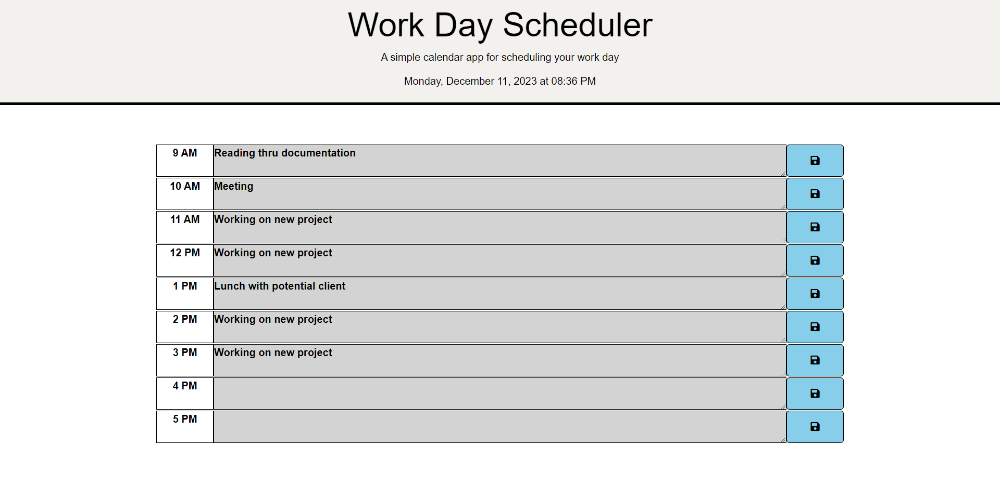

# Planner-app
A simple calendar application saves events for each hour of the day. The application runs in a browser and uses the Day.js library.

# Preview
Here is a mock-up of how the page looks.

 

# Built With

 - HTML
 - CSS
 - Javascript
 - jQuery
 

This project was built to highlight skills learned in Javascript and Local Storage

# Website
 - https://sebswit.github.io/planner-app/

 Resourses used for this challenge
 - https://developer.mozilla.org/,
 - https://www.freecodecamp.org/,
 - https://www.youtube.com/@BroCodez,
 - https://medium.com/,
 - https://jqueryui.com/

 # Copyright
The project has been created for learning purposes and there is no copyright on it.